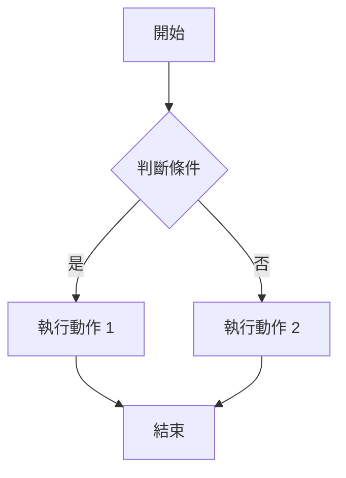
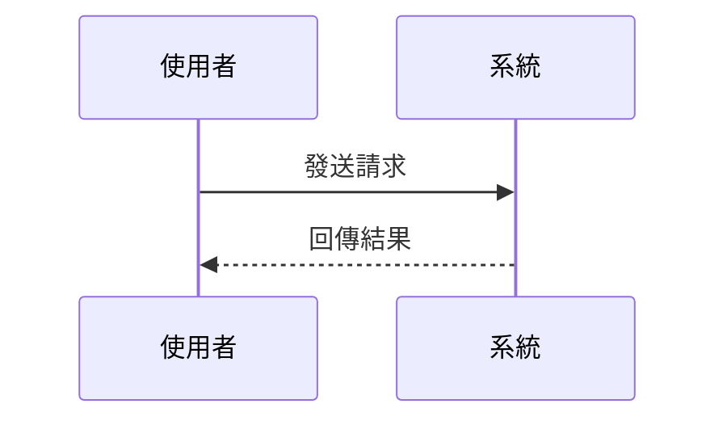

# Markdown to DOCX 範例

這是一個展示 **Markdown 轉 DOCX** 功能的範例文件。

## 基本格式

- **粗體文字**
- *斜體文字*
- `行內程式碼`

## 表格

| 欄位 | 說明 |
|------|------|
| 名稱 | 這是名稱欄位 |
| 數量 | 這是數量欄位 |

## 程式碼區塊

```javascript
function hello() {
  console.log("Hello, World!");
}
```

## Mermaid 流程圖



## Mermaid 時序圖



## 清單

1. 第一項
2. 第二項
   - 子項目 A
   - 子項目 B
3. 第三項
